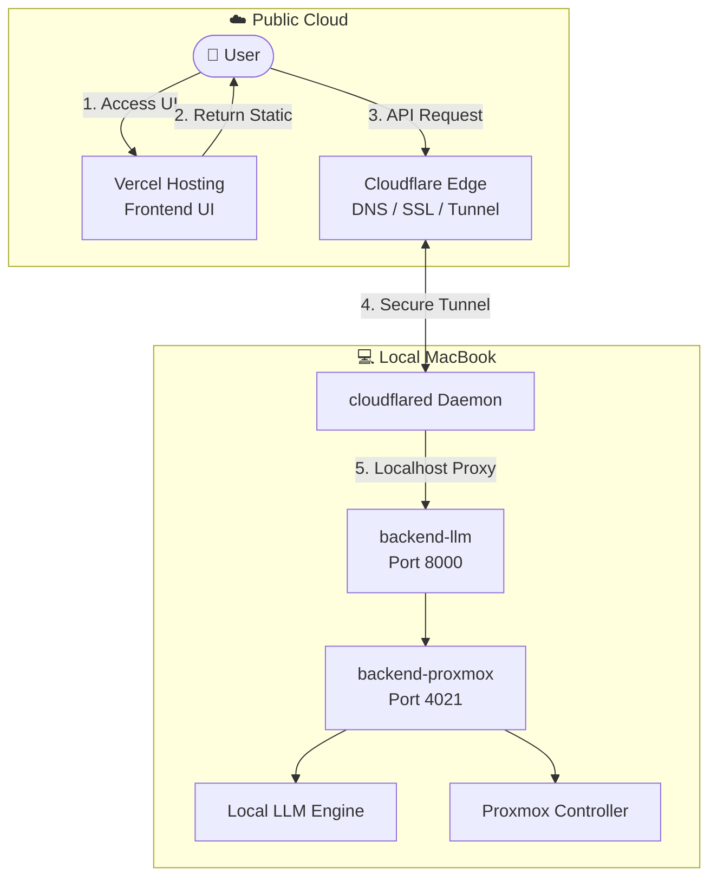

# infra402 Deployment Specifications

## Architecture Overview

하이브리드 배포 아키텍처: Vercel(Frontend) + Local MacBook(Backend) + Cloudflare Tunnel



---

## Required Accounts & Resources

| 항목 | 용도 | 필수 여부 |
|------|------|----------|
| **Vercel 계정** | Frontend 배포 | ✅ 필수 |
| **Cloudflare 계정** | Tunnel + 도메인 관리 | ✅ 필수 |
| **도메인** | `api.mydomain.com` 용 | ✅ 필수 (Cloudflare에 연결) |
| **OpenAI API Key** | LLM Provider (기본값) | 🔄 택1 |
| **Flock.io API Key** | LLM Provider (대안) | 🔄 택1 |
| **EVM Wallet Private Key** | x402 결제 서명용 | ✅ 필수 |
| **Proxmox 접근권한** | 컨테이너 관리 | ✅ 필수 |

> [!NOTE]
> LLM Provider는 OpenAI 또는 Flock.io 중 하나만 선택하면 됩니다.
> - OpenAI 사용 시: `LLM_PROVIDER=openai` + `OPENAI_API_KEY`
> - Flock.io 사용 시: `LLM_PROVIDER=flockio` + `FLOCKIO_API_KEY`

---

## Repository Structure

```
infra402/
├── frontend/              # Vite + React (TypeScript)
│   ├── src/
│   ├── package.json
│   └── vite.config.ts
├── backend-llm/           # FastAPI Agent Service (Port 8000)
│   ├── pydantic-server.py
│   └── pyproject.toml
├── backend-proxmox/       # FastAPI Paywall Server (Port 4021)
│   ├── main.py
│   ├── routers/
│   └── pyproject.toml
└── .claude/               # Deployment Documentation
    ├── claude.md          # AI Agent Instructions
    ├── specs.md           # This File
    ├── plan.md            # Implementation Plan
    └── task.md            # Task Tracking
```

---

## Component Specifications

### 1. Frontend (Vercel)

| Item | Value |
|------|-------|
| Framework | Vite + React + TypeScript |
| Build Command | `pnpm build` |
| Output Dir | `dist` |
| Root Directory | `frontend` |
| Node Version | 18.x |

**Environment Variables:**
| Variable | Example Value | Description |
|----------|---------------|-------------|
| `VITE_CHAT_API_BASE` | `https://api.mydomain.com` | Backend API endpoint via Cloudflare Tunnel |

---

### 2. Backend LLM Service (Local)

| Item | Value |
|------|-------|
| Framework | FastAPI + Pydantic-AI |
| Port | 8000 |
| Entry Point | `pydantic-server.py` |
| Endpoints | `/chat`, `/info` |

**Environment Variables:**
| Variable | Description |
|----------|-------------|
| `LLM_PROVIDER` | `openai` or `flockio` |
| `OPENAI_API_KEY` | OpenAI API key (if using openai) |
| `FLOCKIO_API_KEY` | Flock.io API key (if using flockio) |
| `PRIVATE_KEY` | EVM wallet private key for x402 |
| `BACKEND_BASE_URL` | `http://localhost:4021` |

**CORS Configuration:** Must allow `https://infra402.vercel.app`

---

### 3. Backend Proxmox Service (Local)

| Item | Value |
|------|-------|
| Framework | FastAPI |
| Port | 4021 |
| Endpoints | `/lease/*`, `/management/*` |

---

### 4. Cloudflare Tunnel

| Item | Value |
|------|-------|
| Daemon | `cloudflared` |
| Public Hostname | `api.mydomain.com` (user-defined) |
| Service Target | `http://localhost:8000` |
| Protocol | HTTPS (automatic SSL) |

---

## Network Flow

1. **User → Vercel**: Static frontend 로드 (https://infra402.vercel.app)
2. **User → Cloudflare**: API 요청 (https://api.mydomain.com)
3. **Cloudflare → cloudflared**: 암호화된 gRPC 터널
4. **cloudflared → Backend**: localhost:8000으로 프록시
5. **Backend-LLM → Backend-Proxmox**: 내부 API 호출 (localhost:4021)

---

## Constraints & Prerequisites

> [!CAUTION]
> MacBook이 백엔드 서버이므로 **Sleep Mode 방지**를 수동으로 설정해야 합니다.

- MacBook은 항상 켜져 있어야 함 (Prevent Sleep)
- 안정적인 인터넷 연결 필요
- Local LLM 모델 및 Proxmox 노드 접근 필요
- Cloudflare 계정 및 도메인 필요
